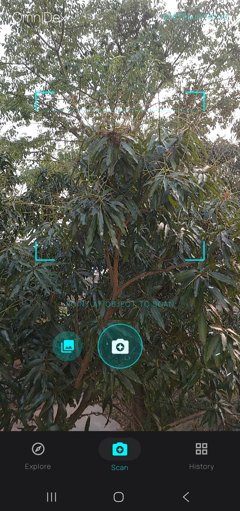
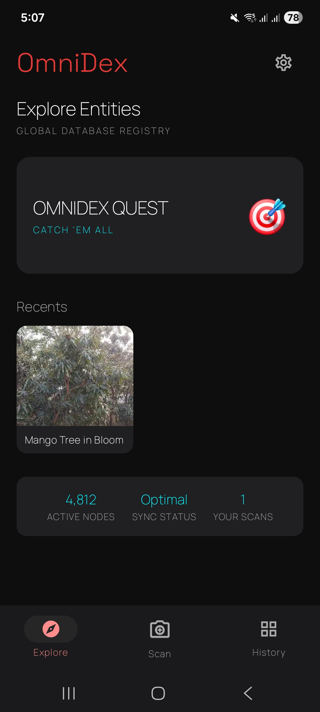
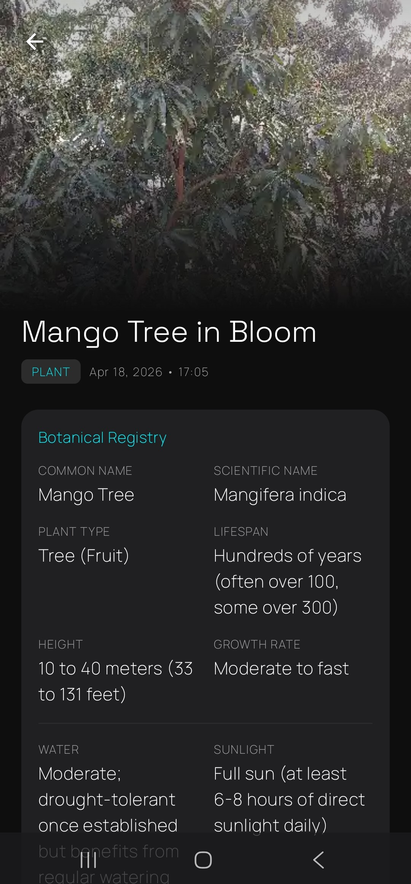
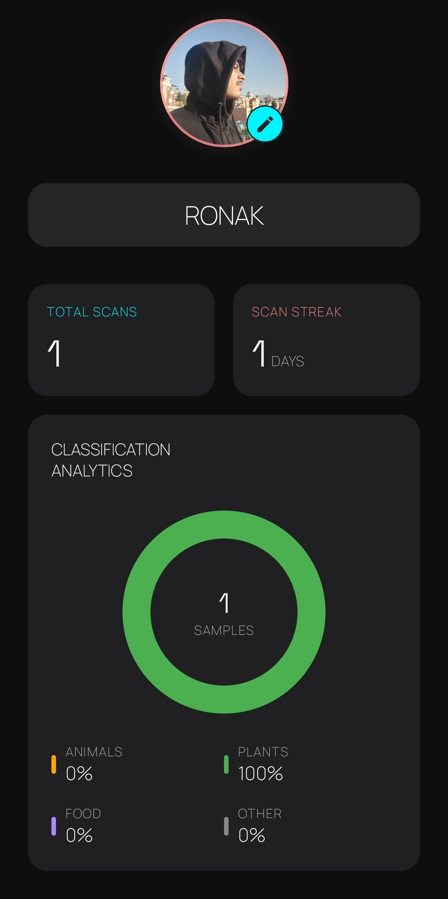
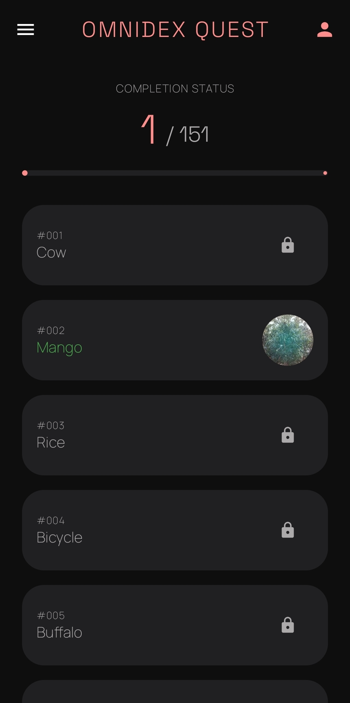

<!-- HERO BANNER -->

  

<h1 align="center">OmniDex</h1>

  AI-powered Pokédex-style scanner for the real world

  
  
  
  

---

## 🚀 Overview

**OmniDex** is a modern Pokédex-style Android app that uses your camera to scan real-world objects and generate rich, fun, Pokédex-inspired insights using Google Gemini.

---

## ⬇️ Download

  

### 📦 How to Install

1. Click the **Download button above**  
2. You will be taken to the latest release page  
3. **Scroll down to the Assets section**  
4. Find the `.apk` file and download it  
5. Open the downloaded APK  
6. Install OmniDex  
7. Launch the app  
8. Enter your API key  
9. Start scanning  

---

## 🧠 Features

### 🔍 AI-Powered Scanning
- Scan real-world objects using your camera  
- Get AI-generated:
  - Object name  
  - Description  
  - Fun facts  
  - “Did you know?” trivia  
  - Classification / category  

---

### 🎯 Quests System
- Complete your own **OmniDex** by scanning items  
- Includes **151 items** across:
  - Animals  
  - Plants  
  - Food  
  - Objects  
- Adds a fun, goal-based experience to scanning  

---

### 👤 User Profile
- Create your **profile with name and photo**  
- View your **scan progress dashboard**  
- Personalize your OmniDex experience  

---

### 🔍 Smart Scanner Controls
- Smooth **Zoom In / Zoom Out** while scanning  
- Better framing and object capture  

---

### 🔄 Smart Updates
- Automatically **checks for updates on every app startup**
- Keeps users informed about the latest version
- Seamless and non-intrusive update experience

---

### 💾 Backup & Restore System
- Create **compressed backups** of your app data  
- Restore backups **instantly without manual steps**  
- Backup reminder shown before updating  
- Ensures data safety and easy migration  

---

### 🗂 Collection Management
- **Long press to select items**  
- Select multiple or **select all**  
- Delete items instantly in bulk  
- Faster and easier history management  

---

### ⚙️ Organized Settings
- Settings are now **categorized by functionality**  
- Cleaner layout and easier navigation  

---

### 💾 Storage Efficient Design

OmniDex is built to be extremely storage-efficient:

#### 📸 Images
- Stored in **WEBP (lossy)**  
- Resized to **512 × 512**  
- Target size: **~40KB per image**  

#### 🧾 Text
- Stored in **structured JSON format**  
- No raw API responses  
- Minimal storage footprint  

---

### 🎨 UI / UX
- Dark mode by default  
- Pokédex-inspired red theme  
- Blue glowing scan button  
- Smooth animations and transitions  
- Clean, modern, professional interface  
- Continuous UI improvements across updates  

---

## 📸 Screens

- Scanner View  
- API Setup Screen  
- Explore Categories  
- Collection / History  
- Scan Result  
- Settings  
- User Profile  
- Quests  

---

## ⚙️ How It Works

1. Open the app  
2. Go to **Settings**  
3. Enter your Gemini API key  
4. Go to **Scan**  
5. Capture an image  
6. App sends image to Gemini  
7. Receive AI-generated result  
8. View and save scan locally  

---

## 🔑 Gemini API Setup

OmniDex requires a **Google Gemini API key**.

### Setup Steps

1. Open **Settings**  
2. Tap **Manage Gemini API Key**  
3. Paste your API key  
4. Save it  
5. Start scanning  

### 🔒 Notes
- API key is stored locally  
- Only used for Gemini API requests  
- Required for scanning  

---

## 🧱 Tech Stack

- Kotlin  
- Android Studio  
- CameraX  
- Google Gemini API  
- Room Database  
- SharedPreferences / DataStore  
- WebP Compression  
- Material Design  

---

## 🧠 Architecture

- **UI Layer** — Activities / Fragments  
- **ViewModel Layer** — Logic  
- **Repository Layer** — Data handling  
- **Data Layer** — Room + API  

---

## 📂 Local Storage Strategy

### Images
- Compressed WebP format  
- Downscaled to reduce memory  

### Data
- Structured minimal storage (JSON-based)  
- No redundancy  

### History
- Stored locally  
- Lazy loaded  

---

## 🔐 Permissions

- Camera — scanning  
- Internet — Gemini API  
- Storage — saving results  

---

## 🧪 Troubleshooting

### ❌ Scan not working
- Check API key  
- Check internet  
- Enable camera permission  

### ❌ No results
- Verify API key  
- Check API quota  

### ❌ App crashes
- Restart app  
- Reinstall APK  

---

## 🛣️ Roadmap

- Favorites / bookmarks  
- Better filtering  
- Performance improvements  
- Export scan data  
- UI polish  

---

## 📸 Screenshots

  
  
  
  
  

---

## 🛡️ Security
- ✅ App verified by [VirusTotal](https://www.virustotal.com/gui/home/upload)  
- Safe to download and install  

---

## 🙌 Acknowledgments

- Google Gemini (AI engine)  
- Android Studio  

---

## ⚠️ Disclaimer

OmniDex is inspired by the Pokédex concept and is not affiliated with Pokémon, Nintendo, or The Pokémon Company.

---

## 📄 License

MIT License
